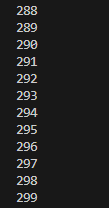
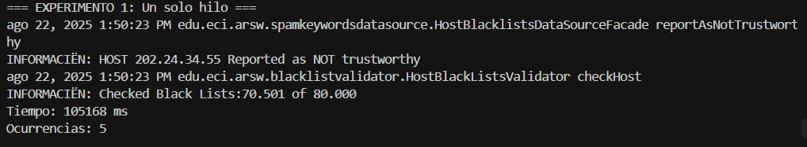
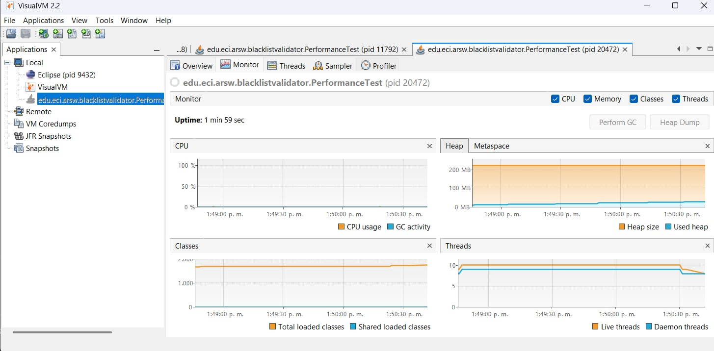
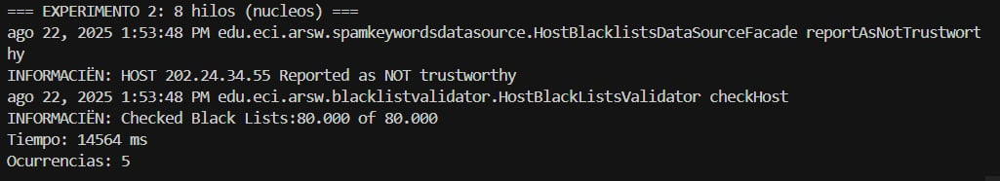
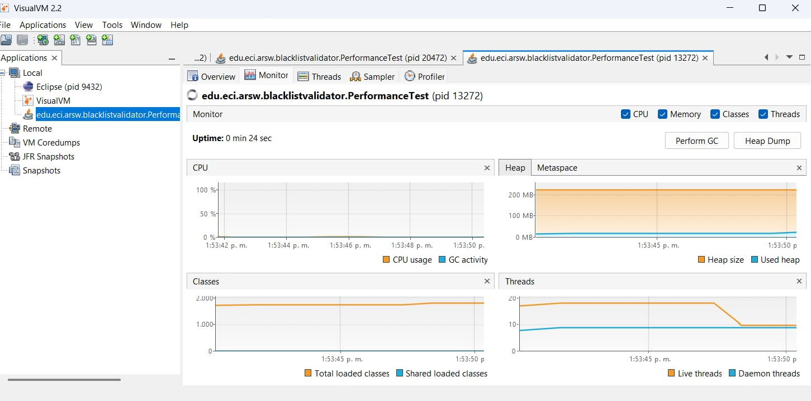
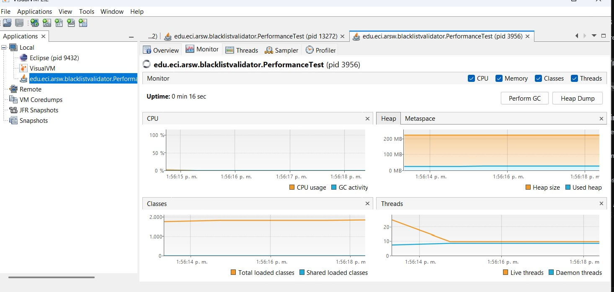
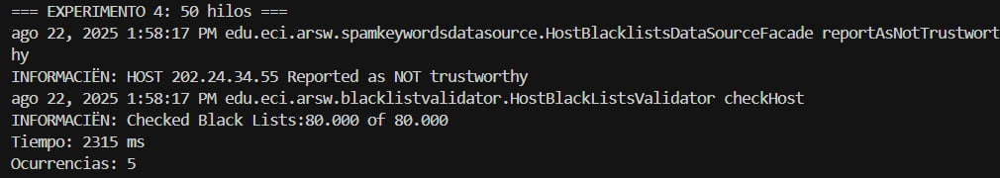
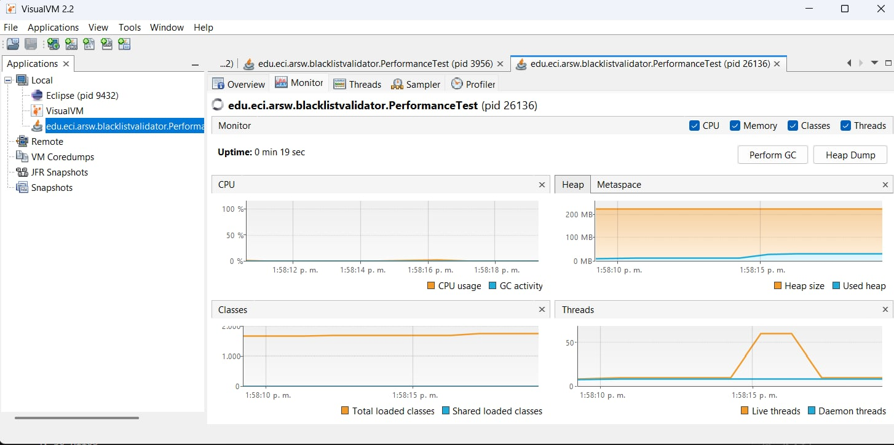
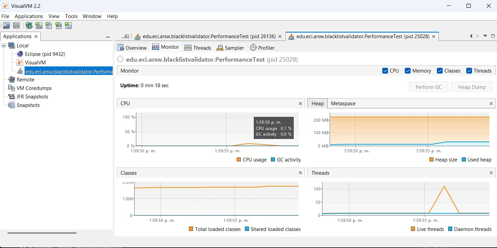
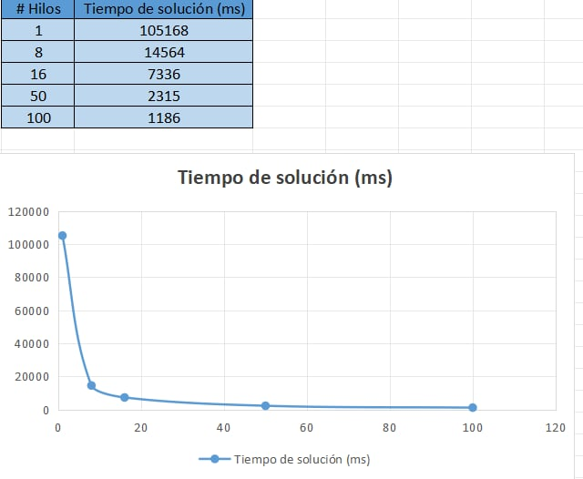

## Escuela Colombiana de Ingeniería
### Arquitecturas de Software - ARSW
## Laboratorio 1 Josué Hernandez

## Parte I - Introducción a Hilos en Java

### 1. ¿Cómo cambia la salida al modificar start() con run()?

**Con `start()`:**
Los resultados se imprimen de forma **mezclada**

**Con `run()`:**
Los resultados se imprimen de forma **secuencial** y **ordenada**

**¿Por qué sucede esto?**

Esto sucede debido a que start() hace que los hilos se ejecuten concurrentemente, por otro lado run() lo ejecuta como cualquier otro método sin aprovechar la concurrencia.
La concurrencia real solo se logra con `start()`, que es la forma correcta de ejecutar hilos en Java.

## Parte III - Evaluación de desempeño
### Experimentos realizados:

1. **Un solo hilo**

2. **Tantos hilos como núcleos de procesamiento**

3. **Doble de núcleos de procesamiento**

4. **50 hilos**

5. **100 hilos**

Gráfica hilos vs tiempo

## Parte IV - Ejercicio Black List Search

### Análisis de Resultados:

#### 1. ¿Por qué el mejor desempeño no se logra con 500 hilos?
Teóricamente hablando, cuanto mayor sea la cantidad de hilos mejor debería ser el desempeño. Sin embargo, siguiendo la ley de Amdahl, podemos comprobar que el crecimiento no es lineal en base a los hilos utilizados, esto significa que se llega a un punto en el que la mejora de rendimiento en base a la cantidad de hilos se vuelve prácticamente imperceptible.

#### 2. ¿Cómo se compara el desempeño con 200 hilos?

Con 200 y 500 hilos el desempeño es casi el mismo, podemos usar como referencia la gráfica mostrada en el punto anterior, en esta se puede ver como la mejoría entre aumentar la cantidad de hilos es cada vez menos, destacando especialmente el aumento entre 50 y 100 hilos, por lo que de 200 a 500 sería casi igual.

#### 3. ¿Núcleos vs Doble de núcleos?

El utilizar el doble de hilos a núcleos de procesamiento nos da una mejoría notable entre utilizar solo la cantidad de hilos a núcleos de procesamiento, esto es debido a que aún nos encontramos en un número bajo de hilos para realizar el trabajo.

#### 4. ¿1 hilo en 100 máquinas hipotéticas aplicaría mejor la Ley de Amdahl?

Sí, aplicaría mejor usar 1 hilo en cada una de 100 máquinas porque cada hilo tendría todos los recursos de la máquina para él solo, no habría competencia por memoria, procesador o cualquier otro recurso.

#### 5. ¿c hilos en 100/c máquinas distribuidas sería mejor?

Esta sería una buena opción porque aprovecha completamente los núcleos de cada máquina sin desperdiciar recursos. Por ejemplo, si cada máquina tiene 4 núcleos, usando 4 hilos en 25 máquinas obtendríamos el máximo rendimiento de cada máquina individual, manteniendo los 100 hilos totales distribuidos entre las máquinas.
